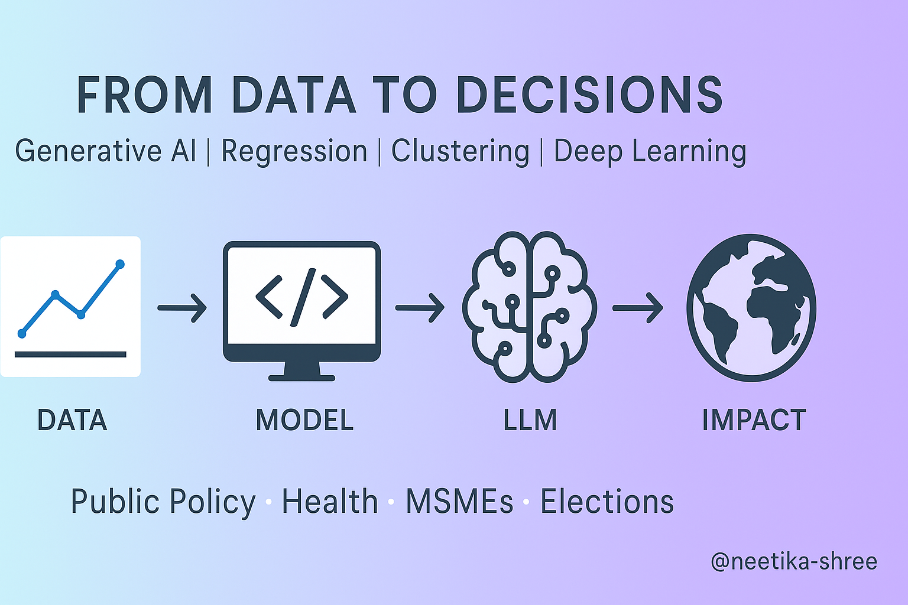

<table>
  <tr>
    <td>
      <h1>👋 Welcome to my GitHub!</h1>
      
Experienced Data Scientist | GenAI | Public Policy

    </td>
    <td align="right">
      
    </td>
  </tr>
</table>

I'm a **Data Scientist** solving real-world problems using Statistics,Core Machine Learning,Deep Learning,NLP and GenAI. My work spans **regression analysis**, **unsupervised clustering**, **Generative AI and LLM-powered systems**, and **deep learning architectures**, applied to real-world challenges in **public health**, **election strategy**, **MSME development**, and **government policy analytics**.

Currently building robust, reproducible AI workflows using **PyTorch**, **LangChain**, **Docker**, and **AWS** :with a focus on modularity, deployment, and impact.

### Languages and Tools

`python` `pytorch` `scikit_learn` `huggingface`  
`docker` `aws` `langchain` `openai` `flask` `streamlit`  
`pandas` `numpy` `matplotlib` `seaborn` `sql`
`git`  `bash` `yaml`

### Current Focus Areas

- 🚀 **Generative AI**: RAG pipelines, prompt engineering, LLM finetuning  
- 📊 **Applied Data Science**: Health, finance, public policy  
- 🧪 **ML Research**: Clustering, model interpretability, evaluation metrics  
- 🐳 **MLOps**: Model deployment with Docker & AWS (ECR, EC2, S3)

